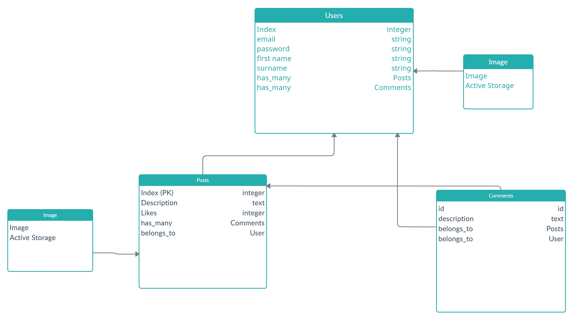
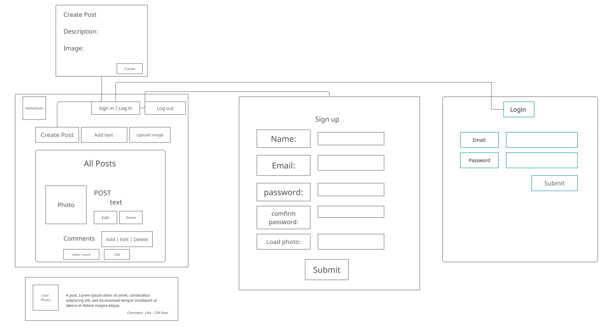

# README

This README would normally document whatever steps are necessary to get the
application up and running.

Things you may want to cover:

* Ruby version

  3.0.2
* System dependencies

  Rails >= 6.1.4
* Configuration

  **Please run this command from the project directory**
  ```
   cp pre-push .git/hooks/
  ```
* Database creation

  

* Web creation

  
* Database initialization

* Database seeds:
If you want to see the app in its full glory, seed the database.

From the project directory run:
`rails db:drop`
`rails db:create`
`rails db:migrate`
`rails db:seed`

You can login as any of the seeded users to interact with the seeded post or create your own.

Mary Poppins
Harry Potter
Clark Kent
Bruce Wayne
Ash Ketchum
Count Dracula

Their email addresses are: <first letter of first name>@<first letter of last name>.com
All passwords are: 12345678

* How to run the test suite

* Services (job queues, cache servers, search engines, etc.)

* Deployment instructions

* ...


# AceBook

## Quickstart

First, clone this repository. Then:

```bash
> bundle install
> bin/rails db:create
> bin/rails db:migrate

> bundle exec rspec # Run the tests to ensure it works
> bin/rails server # Start the server at localhost:3000
```

## Troubleshooting

If you don't have Node.js installed yet, you might run into this error when running rspec:

```
ExecJS::RuntimeUnavailable:
  Could not find a JavaScript runtime. See https://github.com/rails/execjs for a list of available runtimes.
 ```

Rails requires a Javascript runtime to work. The easiest way is to install Node by running `brew install node` - and then run `bundle exec rspec` again
